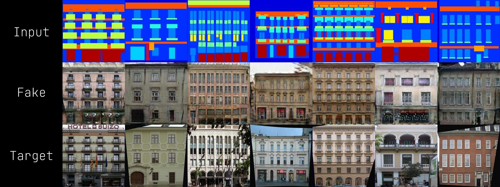
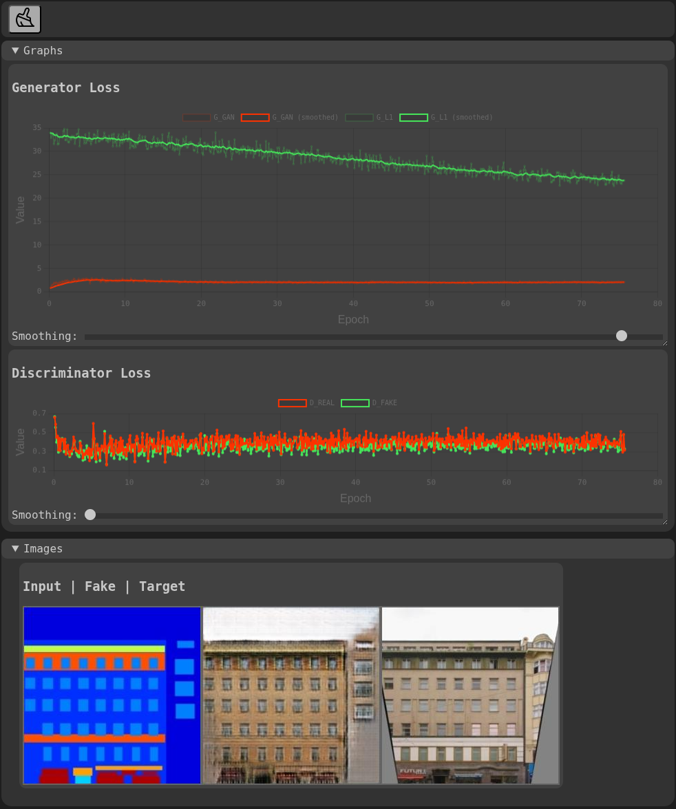

<div align="center">
<h1>NectarML</h1>

<p>
    <a href="https://github.com/ZacharyBork/NectarML/releases/latest">
    </a>
    <a href="https://opensource.org/licenses/Apache-2.0">
    </a>
    <a href="https://www.python.org/downloads/">
    </a>
    <a href="https://developer.nvidia.com/cuda/toolkit">
    </a>
</p>

<h4>A deep learning framework with hand-written C++/CUDA backend, reverse-mode autograd, a PyTorch-shaped Python API, and a 110-transform augmentation library.</h4>
</div>

<p align="center">

<sub>Pix2Pix, trained end-to-end in NectarML; no PyTorch in the loop. Input, generated output, ground truth.</sub>
</p>


## Description

NectarML is a feature-complete deep learning framework with its own custom tensor library, reverse-mode automatic differentiation, a C++/CUDA compute backend, mixed-precision training with gradient scaling, a full data loading stack, and a 110-transform augmentation library.

Every component has been numerically validated against PyTorch by an automated suite of **794 tests**, covering forward and backwards passes in both float32 and float16. The framework has trained real models end-to-end; the Pix2Pix implementation above was trained for 200 epochs entirely in NectarML, and it's loss curves and generated output exactly mirror those of the same model implemented in PyTorch.

The API deliberately mirrors PyTorch 1:1 in almost every aspect. Most models can be copy-pasted between the two frameworks with just a module change. This is a conscious design choice. My core goal with this project was not to create a replacement for PyTorch, but instead to better understand how PyTorch works under the hood.

| | |
| ----------------- | ------------------------------------------- |
| **Python**        | 18,595 lines                                |
| **C++ / CUDA**    | 11,069 lines across 95 files                |
| **Test suite**    | 794 tests, validated against PyTorch        |
| **Augmentations** | 110 transforms, GPU-native                  |
| **Procedurals**   | Noise, fractal, SDF, and pattern generators |

## Features

### Core

- Custom `Tensor` class(es), backed by NumPy on CPU, and hand-written CUDA kernels on GPU, with a unified dtype abstraction layer.
- Full reverse-mode automatic differentiation (autograd) engine. Every operation in the framework, from convolutions, to normalizations, to attention and interpolation all define their own backward pass.
- Mixed-precision training via `nectarml.amp` with autocast contexts and gradient scaler.
- `no_grad` context manager and decorator, per-operation AMP flags, and inference-mode module switching.

### Neural Network Library

- **Layers:** Linear (fully-connected), Conv1d/2d, ConvTranspose1d/2d, Upsample, Identity, and five padding families (constant, reflection, replication, circular, zero) across 1d/2d/3d.
- **Normalization:** BatchNorm1d/2d/3d, InstanceNorm1d/2d/3d, GroupNorm, and LayerNorm, with fused CUDA kernels for Batch and Instance normalization.
- **Attention**: Scaled dot-product attention and multihead attention with learnable parameters.
- **Activations:** 18 modules covering numerous domains. From ReLU and GELU, to Mish, SiLU, Softmin, and the hard-* family.
- **Losses:** 15 modules spanning regression, classification, probabilistic, and ranking objectives.
- **Dropout:** Standard, alpha, feature-alpha, and 1d/2d/3d variants.
- **Initialization:** 14 schemes including Xavier/Kaiming (uniform and normal), orthogonal, truncated normal, sparse, and Dirac.
- **Composition:** `Sequential`, `ModuleList`, `ModuleDict`, recursive `.apply()`, and parameter/buffer traversal.

### Optimization

- SGD, SGD w/ Nesterov momentum, Adam, AdamW, and NAdam, **each with fused CUDA kernels**, meaning a full parameter update is a single kernel launch, rather than a chain of elementwise operations.
- **Mixed-precision-aware:** Optimizers interoperate with `nectarml.amp` autocast and gradient scaling.
- **12 learning rate schedulers**, including `CosineAnnealingWWarmRestarts`, `OneCycleLR`, `CyclicLR`, `ReduceLROnPlateau`, and `SequentialLR` for schedule composition.
- Checkpoint save/load covering model state, optimizer state, and arbitrary user metadata.

### CUDA Backend

Dense matrix multiplication is dispatched to cuBLAS. Everything above is implemented in-house; there is no cuDNN dependency.

- **Convolution and transposed convolution** are custom implementations rather than cuDNN calls. Each is an explicit `im2col` -> `GEMM` -> `col2im` pipeline. A custom im2col kernel materializes the patch matrix (with full support for stride, padding, and dilation), cuBLAS performs the matmul operation, and custom bias and layout-transposition kernels produce the final NCHW output.
- **Custom kernels** for pooling, upsampling, and interpolation, elementwise math, reductions, indexing, padding, tensor combination, memory management, and some components of the vision transforms library.
- **Fused kernels** for BatchNorm and InstanceNorm, and for the full SGD / Adam / AdamW / NAdam parameter update.
- Kernals are templated float32, float16, uint8, and int32.
- **A fully configurable custom allocator pool** recycles allocated buffers rather than reissuing them, significantly reducing the required number of `cudaMalloc` calls.
- Explicit device memory management and a host-side dispatch layer, exposed to Python via pybind11 bindings.
- Roughly 11,000 lines of C++/CUDA across 26 kernel translation units, 29 host-side sources, and 40 headers.

### Vision and Augmentations

The vision transforms library consists of 110 transforms across 10 categories. The included transforms operate on tensors directly, meaning many of them can run natively on the GPU, and several have dedicated CUDA kernels.

| Category | Count | Examples |
| --- | --- | --- |
| Spatial | 17 | RandomResizedCrop, RandomPerspective, ElasticTransform, GridDistortion, OpticalDistortion, Swirl |
| Color | 24 | ColorJitter, CLAHE, HueSaturationValue, TonemapHDR, ChromaticAberration, Vignetting, Quantize |
| Blur | 7 | GaussianBlur, MotionBlur, MedianBlur, UnsharpMask, Emboss |
| Noise | 6 | GaussianNoise, ISONoise, SpeckleNoise, MultiplicativeNoise, ImageCompression |
| Erasing | 9 | CoarseDropout, GridDropout, RandomFog, RandomRain, RandomSnow, RandomShadow, Spatter |
| Filter | 10 | Sobel, Prewitt, Laplacian, Kuwahara, Halftone, Dither, DifferenceOfGaussians |
| Normalization | 5 | Normalize, Denormalize, MinMaxNormalize, ToFloat, ToUint8 |
| Format | 11 | ToTensor, ToPIL, ToNumpy, ToTorch, FromTorch, ToCUDA, ConvertDtype |
| Composition | 5 | Compose, RandomApply, RandomChoice, RandomOrder, OneOf |
| Utility | 16 | ApplyLUT, NormalMap, UVMap, Morphological, OverlayText, MaskedFill, Derivative |

Because transforms operate on tensors and can be moved to the device at any point in the pipeline, data augmentation can be pushed to the GPU where worker-parallel CPU augmentations would otherwise bottleneck the loader:

```python
import nectarml.vision.transforms as xforms

transforms = xforms.Compose(
    xforms.ToCUDA(), # <-------------------------------- everything below runs on device
    xforms.RandomHorizontalFlip(p=0.5),
    xforms.Resize(size=(286, 286), mode='bilinear'),
    xforms.RandomCrop(size=(256, 256)),
    xforms.Normalize(mean=0.5, std=0.5)
)

input, target = transforms(image=input, image2=target) # paired transforms stay in sync
```

In addition to the transforms, `nectarml.vision.utils` provides tensor-native image I/O utilities including `load_image`, `save_image`, `make_grid`, and PIL interchange.

### Procedural Generators

`nectarml.vision.procedurals` provides a set of texture and pattern generators that emit tensors directly. These can be used for synthetic data generation, masking, test fixtures, and augmentation inputs. All generators share a common `Generator` base class, and can be configured to target any device and/or dtype.

- **Noise:** Perlin, OpenSimplex2, value, cellular/Voronoi, and white noise, with fBm, ridged, and ping-pong fractal modes, configurable octaves, persistence, lacunarity, and selectable cellular distance metrics.
- **Fractals:** Mandelbrot, Julia, and Burning Ship, with arbitrary exponent, zoom, rotation, and iteration depth. Optional **orbit-trap** coloring (point, cross, circle, box, and combined traps, or a user-supplied trap function), plus five built-in color ramps with linear interpolation between stops.
- **Signed distance fields:** Cicle, square, triangle, pentagon, hexagram, and pentagram primitives, with rotation and centering. Boolean composition (union, subtraction, difference) in both hard and radius-smoothed variants, and SDF-to-raster conversion via iso-thresholding, two-color mapping, or contrast-adjustable color ramps.
- **Patterns:** Checkerboard with arbitrary tiling, and Chladni cymatic patterns with configurable modal numbers, thresholding, and distance-transform edge smoothing.
- **Color fields:** Solid fills with horizontal, vertical, radial, and elliptical gradients with adjustable falloff.

SDF composition composes naturally, since combination operators take and return tensors:

```python
from nectarml.vision.procedurals import SdfCreate, SdfCombine, SdfColorRamp

hexagon = SdfCreate(size=(512, 512), sdf_type='hexagon', radius=0.6).generate()
star    = SdfCreate(size=(512, 512), sdf_type='pentagram', angle=15.0).generate()

combined = SdfCombine(method='subtract', radius=0.05).generate(hexagon, star)
image    = SdfColorRamp(color1=(255, 80, 0), color2=(20, 0, 60)).generate(combined)
```

> [!NOTE]
> The SDF primitives and combination functions are adapted from Inigo Quilez's published [distance function articles](https://iquilezles.org/articles/distfunctions2d/).

### Dataloading

- `Dataloader` with batching, shuffling, multi-worker loading, and a default collate function.
- Map-style and iterable `Dataset` base classes, plus `TensorDataset`, `ImageFolderDataset`, `CSVDataset`, `Subset`, `ConcatDataset`, `ChainDataset`, and `StackDataset`.
- Sequential, random, weighted-random, subset-random, and batch samplers.

### Web Visualizer

NectarML ships with a self-contained, browser-based training visualizer, comparable to [Visdom](https://github.com/fossasia/visdom). It streams example images and live loss curves from a running training job over a local server:

```bash
python -m nectarml.viz.web
```
<p align="center">

<br>
<sub>NectarML web visualizer interface.</sub>
</p>

Please see the included [Pix2Pix example training script](/examples/pix2pix/train.py) for a practical example usage of the web visualizer

## Usage

A training loop in NectarML looks like a training loop in any other deep learning framework:

```python
import nectarml
from   nectarml import nn, optim, utils

### MODEL, OPTIMIZER, SCHEDULE ###

model     = Generator(in_channels=3).to('cuda')
optimizer = optim.Adam(model.parameters(), lr=2e-4, betas=(0.5, 0.999))
scheduler = optim.LinearLR(
    optimizer, start_factor=1.0, end_factor=0.0, total_iters=100
)

### MIXED PRECISION ###

scaler  = nectarml.amp.GradScaler()
loss_fn = nn.L1Loss()

### DATA ###

loader = utils.data.Dataloader(
    dataset, batch_size=16, shuffle=True, num_workers=4
)

### TRAIN ###

for epoch in range(epochs):
    for x, y in loader:
        x, y = x.to('cuda'), y.to('cuda')

        with nectarml.amp.autocast('cuda'):
            prediction = model(x)
            loss       = loss_fn(prediction, y)

        optimizer.zero_grad()
        scaler.scale(loss).backward()
        scaler.step(optimizer)
        scaler.update()

    scheduler.step()

nn.utils.checkpoint(model, optimizer).save('checkpoint.nml.tar', epoch=epoch)
```

Similarly, defining a model should feel equally familiar: subclass `nn.Module` and define `forward()`:

```python
import nectarml
import nectarml.nn as nn

class Block(nn.Module):
    def __init__(self, in_channels: int, out_channels: int) -> None:
        super().__init__()
        self.conv = nn.Sequential(
            nn.Conv2d(
                in_channels, out_channels, kernel_size=4, stride=2,
                padding=1, bias=False, padding_mode='reflect'
            ),
            nn.InstanceNorm2d(out_channels),
            nn.LeakyReLU(0.2)
        )

    def forward(self, x: nectarml.Tensor) -> nectarml.Tensor:
        return self.conv(x)
```

## Validation

Numerical correctness of all components was treated as the primary constraint throughout development.

### Numerical parity with PyTorch

```
$ pytest tests/automatic
collected 794 items

tests/automatic/test_functionals.py ........................................ [ 31%]
tests/automatic/test_nn.py .............................................     [ 54%]
tests/automatic/test_tensor_methods.py .................................     [ 82%]
tests/automatic/test_vision_transforms.py .............................      [100%]

=================== 791 passed, 3 skipped, 10 warnings in 6.05s ===================
```

Every operation is compared against its `torch` equivalent op-by-op. Both frameworks' results are converted to NumPy before comparison, so neither side if given a structural advantage, and every case is run in **both float32 and float16 on CUDA.**

| Precision | Tolerance (forward) | Tolerance (backward) |
| --------- | ------------------- | -------------------- |
| float32   | 1e-4                | 1e-3                 |
| float16   | 1e-2                | 5e-2                 |

### Coverage spans

- **Tensor operations:** Arithmetic dunders, math, rounding, clamping, reductions, sorting, indexing, and advances indexing.
- **Functionals:** Activations, losses, normalization, pooling, padding, dropout, interpolation, attention, reductions, and shape ops. All tested forward and backward.
- **`nn` modules:** Linear, convolutions, normalization, pooling, padding, upsampling, dropout, losses, multi-head attention, weight inititalization, module utilities (`.to()`, `.train()`/`.eval()`, `.zero_grad()`), and full composed networks.
- **Vision transforms:** Validated by invariant rather than parity, since most included transforms have no PyTorch equivelent: output shape, dtype preservation, value range, absence of NaN/Inf, `p=0` passthrough, `p=1` always apply, and composed pipeline behaviour.

### End-to-end training
- **Pix2Pix:** U-Net-style generator, PatchGAN descriminator, mixed precision with gradient scaling, two-optimizer adversarial loop, and a two-stage LR schedule (constant->linear decay). Loss curves and generated outputs are visually indistiguishable from an identical model implemented in PyTorch.
- **Variational autoencoder:** A second architecture, exercising a separate set of the framework's components.

> [!NOTE]
> Fully annotated examples of each can be found in the [`examples/`](/examples/) directory, written in a walkthrough/tutorial style, rather than as minimal scripts.

## Tech Stack

| Type                 | Technology                                                                     |
| -------------------- | ------------------------------------------------------------------------------ |
| **Compute Backend**  | C++17, CUDA                                                                    |
| **GPU Libraries**    | cuBLAS, cuRAND                                                                 |
| **Bindings**         | [pybind11](https://github.com/pybind/pybind11)                                 |
| **CPU Backend**      | Python, [NumPy](https://numpy.org/)                                            |
| **Image I/O**        | [Pillow](https://python-pillow.org/), [OpenCV](https://opencv.org/)            |
| **Procedural Noise** | [FastNoiseLite](https://github.com/Auburn/FastNoiseLite)                       |
| **Build System**     | CMake + [scikit-build-core](https://github.com/scikit-build/scikit-build-core) |

## Installation

NectarML currently targets **Linux with an NVIDIA GPU.** Windows and macOS are not currently supported.

### Prerequisites

- CMake ≥ 3.18
- Python ≥ 3.12 with [pybind11](https://github.com/pybind/pybind11) and [scikit-build-core](https://github.com/scikit-build/scikit-build-core) installed.
- NVIDIA CUDA Toolkit ≥ 12.8, with matching driver installed.

Runtime dependencies are resolved automatically by pip: NumPy, Pillow, OpenCV, Matplotlib, psutil, aiohttp, and pyfastnoiselite.

> [!NOTE]
> It is recommended to install NectarML in a fresh Python environment.

### Build

```bash
# Clone the repository
git clone https://github.com/ZacharyBork/NectarML.git

# Change directory to repository root
cd NectarML

# Install via pip (scikit-build-core)
pip install .
```

No pre-compiled binaries are currently distributed. The project must be built from source. **Wheels are planned for a future release.**

### Verifying your Installation

Running the validation suite requires additional dependencies which are not included with the default pip install. These include [`pytest`](https://docs.pytest.org/en/stable/) and [`pytest-cov`](https://github.com/pytest-dev/pytest-cov), which can be installed with the following command:
```bash
pip install ".[dev]"
```
Additionally, the validation suite requires a CUDA-enabled version of PyTorch installed. This can be obtained [here](https://pytorch.org/get-started/locally/).

> [!IMPORTANT]
> **PyTorch is only used as a reference for validation,** it is not a dependency of the framework itself.

With the validation dependencies installed, the validation suite can be run with the following command:
```bash
pytest tests/automatic
```

## Roadmap

NectarML is under active development. Planned work, in rough order of priority:

- **C++ autograd engine.** Graph traversal is currently orchestrated by Python. This allowed for rapid development, but is very slow, especially when training deeper networks. Moving the autograd engine to the C++ layer is the single largest available performance improvement, and the highest priority item on this list.
- **CUDA-only focus.** The CPU backend will be deprecated in a future release, so that I can focus development efforts on the CUDA backend exclusively. Mainting both paths, especially with the current architecture, is a substantial amount of work for little payoff, and presents too many opportunities to introduce bugs in one of the paths.
- **Additional optimizers.** RMSProp, Adagrad, Adamax, RAdam, Adadelta, LBFGS, and the newer Lion / Sophia / Adafactor family are among the planned optimizers for future releases.
- **More 3D tensor support.** Currently the framework primarily supports one and two-dimensional tensors. Additional support for 3D tensors will be added in future releases.
- **Grouped convolutions in CUDA.** Currently, the CUDA path does not support grouped convolutions, and will raise an exception with CUDA tensors when `groups!=1`.
- **Interoperability layers.** Right now, it is possible to convert tensors between NectarML and PyTorch. However, this only works for data tensors, and will sever the autograd graph for tensors with gradients. It is also not possible currently to convert modules or optimizers between the two frameworks. This functionality will be expanded in the future, and eventually will also support conversion for JAX. ONNX support will also be added eventually (although this is a surprisingly difficult thing to do correctly, and may take significant time).
- **Documentation.** Currently the only real form of documentation comes in the form of docstrings for the Python-side components. Almost all components have docstrings, and they are fairly comprehensive. Eventually, however, full markdown documentation for both end-users and developers will be added.

## Known Limitations

NectarML is an actively developed personal project. **It is not currently production ready software, and does not serve as a replacement for PyTorch.** Current limitiation include:

- **Performance.** As noted above, autograd graph traversal is orchestrated by Python. Functionally, this means that NectarML is, on average, 3-5x slower than PyTorch. Kernel-level performance is comparable, and the autograd engine rewrite will address this problem, hopefully bringing the performance closer to full parity.
- **Linux + NVIDIA only.** No cross-platform support is currently offered, or planned for the near future.
- **Coverage gaps.** Conv3d and ConvTranspose3d are currently not implemented. Grouped depthwise convolution is currently only supported on the CPU path. Several optimizers listed in the roadmap are not currently available.
- **Interoperability.** The PyTorch compatibility layer is currently very minimal. ONNX and JAX interchange have not yet been started.
- **Documentation.** Currently only exists in any real form as docstring on the Python components. This will be addressed in future releases.
- **Distributed training.** Currenly, NectarML only supports single-device training. There is no multi-GPU support. This will be addressed in a future release.

## License

NectarML is licensed under the Apache 2.0 license. A full copy of the license text can be obtained [here](https://apache.org/licenses/LICENSE-2.0).

## Acknowledgements

Please see [REFERENCES.md](REFERENCES.md) for a comprehensive list of references and acknowledgements.

## Related Projects

- [**NectarRender**](https://github.com/ZacharyBork/NectarRender.git): A phyically-based Monte Carlo path-tracing engine with a live, editable scene viewport. C++/CUDA core, PySide6 GUI, wired through pybind11.

